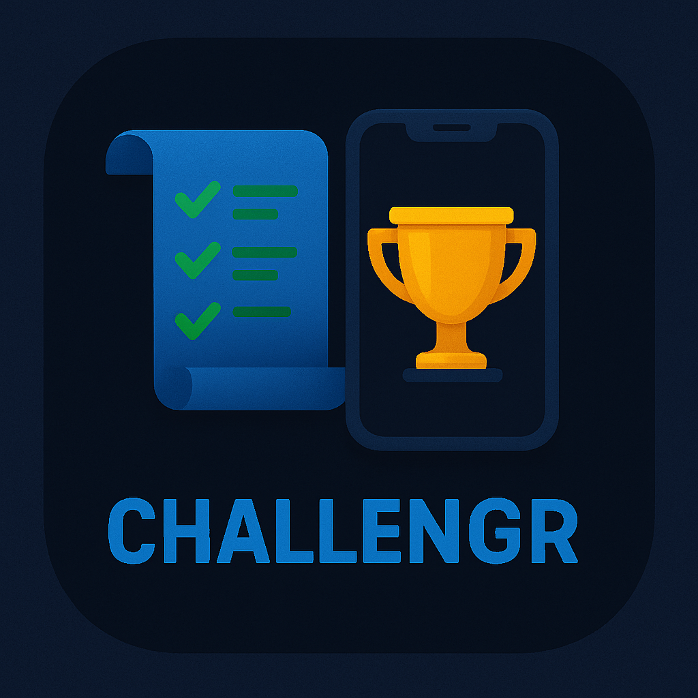

# 🌟 ChallengR - Relevez des défis, transformez-vous ! 🌟

<div align="center">
  
  
  [](https://reactnative.dev/)
  [](https://expo.dev/)
  [](LICENSE)
  [](CONTRIBUTING.md)
</div>

## 📱 Présentation du projet

**ChallengR** est une application mobile inspirante conçue pour vous aider à grandir personnellement à travers des défis quotidiens. Que vous souhaitiez améliorer votre condition physique, votre bien-être mental, vos compétences sociales ou votre créativité, ChallengR vous accompagne dans votre parcours de développement personnel avec une interface immersive et engageante.

<div align="center">
  <em>"Le succès n'est pas définitif, l'échec n'est pas fatal : c'est le courage de continuer qui compte."</em><br>
  - Winston Churchill
</div>

### ✨ Pourquoi ChallengR?

- 🎯 **Objectifs ciblés** : Des défis personnalisés selon vos besoins et objectifs
- 🚀 **Motivation constante** : Système de récompenses et de progression qui stimule l'engagement
- 🌐 **Expérience sociale** : Partagez vos succès et motivez-vous mutuellement
- 📊 **Suivi détaillé** : Visualisez votre croissance avec des statistiques complètes

## 🚀 Fonctionnalités principales

### 🏆 Système de gamification avancé
- **Accumulation de points dynamique** : Gagnez des points proportionnels à la difficulté des défis relevés
- **Progression multi-niveaux** : Système avec 30+ niveaux et objectifs progressivement plus ambitieux
- **Récompenses visuelles interactives** : Animations et effets visuels personnalisés pour célébrer vos accomplissements

### 📅 Défis quotidiens captivants
- **Défis diversifiés et catégorisés** : Plus de 200 activités réparties dans 8 catégories (fitness, bien-être mental, créativité, productivité, apprentissage, socialisation, nutrition, écologie)
- **Rotation intelligente des défis** : Algorithme qui adapte les propositions selon vos préférences et votre historique
- **Équilibre quotidien optimisé** : Maximum 2 défis par jour, scientifiquement calibrés pour encourager la constance sans risque de démotivation

### 🌍 Défis géolocalisés immersifs
- **Carte interactive haute définition** : Découverte intuitive des défis disponibles dans votre environnement
- **Navigation précise intégrée** : Directions détaillées en temps réel pour vous guider
- **Expériences locales uniques** : Défis spécifiques aux points d'intérêt de votre région, actualisés selon les saisons et événements

### 👫 Écosystème social engageant
- **Réseau d'amis et communautés** : Créez des groupes d'intérêt et suivez vos proches
- **Partage multimédia de progression** : Partagez photos, vidéos et réalisations avec votre réseau
- **Communication enrichie** : Messagerie instantanée avec réactions et encouragements personnalisés

### 📊 Analytics de progression avancés
- **Tableau de bord personnalisé** : Visualisation dynamique de votre évolution par domaine
- **Historique complet et filtrable** : Accès à l'ensemble de votre parcours avec recherche intelligente
- **Insights personnalisés** : Recommandations basées sur l'analyse de vos performances

### 🎨 Expérience utilisateur premium
- **Design adaptatif** : Interface qui s'ajuste parfaitement à tous les appareils
- **Retour sensoriel multi-niveaux** : Combinaisons de vibrations, sons et animations pour une immersion totale
- **Thèmes visuels personnalisables** : Choix parmi 8 palettes de couleurs et modes sombre/clair
- **Accessibilité universelle** : Fonctionnalités inclusives pour tous les utilisateurs

## 🛠️ Technologies utilisées

<div align="center">
  <table>
    <tr>
      <td align="center"><br>React Native</td>
      <td align="center"><br>Expo</td>
      <td align="center"><br>React Navigation</td>
      <td align="center"><br>Redux</td>
    </tr>
    <tr>
      <td align="center"><br>AsyncStorage</td>
      <td align="center"><br>Expo Location</td>
      <td align="center"><br>React Native Maps</td>
      <td align="center"><br>Firebase</td>
    </tr>
  </table>
</div>

- **React Native** : Framework cross-platform pour le développement mobile
- **Expo** : Plateforme pour simplifier le développement React Native
- **React Navigation** : Navigation intuitive entre les écrans de l'application
- **Redux** : Gestion d'état centralisée pour l'application
- **AsyncStorage** : Stockage local des données utilisateur
- **Expo Haptics** : Retours haptiques pour améliorer l'expérience utilisateur
- **Expo Linear Gradient** : Effets visuels de dégradés
- **Expo Location** : Services de géolocalisation de haute précision
- **React Native Maps** : Intégration de cartes interactives
- **Expo Camera** : Fonctionnalités avancées liées à l'appareil photo
- **Expo Blur** : Effets visuels de flou
- **Animatable** : Bibliothèque pour animations complexes
- **Firebase** : Services backend pour l'authentification et le stockage

## 🏁 Mise en route rapide

### Prérequis
- Node.js (v14.0.0 ou plus)
- npm ou yarn
- Expo CLI
- Un appareil mobile ou un émulateur

### Installation

1. **Cloner le dépôt**
   ```bash
   git clone https://github.com/votre-username/ChallengR.git
   cd Projet_Web_FINCIR2
   ```

2. **Installer les dépendances**
   ```bash
   npm install
   # ou
   yarn install
   ```

3. **Configurer les variables d'environnement**
   ```bash
   cp .env.example .env
   # Complétez les variables dans le fichier .env
   ```

4. **Lancer l'application**
   ```bash
   npm start
   # ou
   yarn start
   ```

5. **Scanner le QR code** avec l'application Expo Go sur votre appareil mobile ou lancer sur un émulateur.

### Démarrage rapide pour les développeurs

```bash
# Installer les dépendances de développement
npm install --dev

# Exécuter les tests
npm test

# Lancer en mode développement avec rechargement à chaud
npm run dev
```

## 📱 Architecture de l'application

L'application est organisée selon une architecture claire et modulaire suivant les principes de Clean Architecture :

```
Projet_Web_FINCIR2/
├── App.js                    # Point d'entrée de l'application
├── assets/                   # Ressources graphiques et médias
│   ├── fonts/                # Polices personnalisées
│   ├── images/               # Images et illustrations
│   └── animations/           # Fichiers d'animation Lottie
├── components/               # Composants réutilisables
│   ├── common/               # Composants communs (boutons, inputs, etc.)
│   ├── challenges/           # Composants liés aux défis
│   ├── profile/              # Composants liés au profil
│   └── social/               # Composants pour fonctionnalités sociales
├── navigation/               # Configuration des navigateurs
│   ├── AppNavigator.js       # Navigateur principal
│   ├── AuthNavigator.js      # Navigation d'authentification
│   └── TabNavigator.js       # Barre de navigation inférieure
├── screens/                  # Écrans principaux
│   ├── auth/                 # Écrans d'authentification
│   ├── home/                 # Écrans d'accueil
│   ├── challenges/           # Écrans des défis
│   ├── profile/              # Écrans de profil
│   └── social/               # Écrans sociaux
├── redux/                    # Configuration Redux
│   ├── actions/              # Actions Redux
│   ├── reducers/             # Reducers Redux  
│   └── store.js              # Configuration du store
├── services/                 # Services (API, authentification...)
│   ├── api.js                # Service d'API
│   ├── auth.js               # Service d'authentification
│   └── storage.js            # Service de stockage local
├── hooks/                    # Hooks personnalisés
├── utils/                    # Utilitaires et fonctions d'aide
├── contexts/                 # Contextes React
└── constants/                # Constantes de l'application
```

## 🌈 Écrans principaux et fonctionnalités

<div align="center">
  <table>
    <tr>
      <td align="center"><br><strong>Accueil</strong></td>
      <td align="center"><br><strong>Défis</strong></td>
      <td align="center"><br><strong>Profil</strong></td>
    </tr>
  </table>
</div>

### 🏠 Écran d'accueil (HomeScreen)
L'écran d'accueil présente un tableau de bord personnalisé avec:
- Résumé de progression actuelle et niveau
- Défis du jour avec description détaillée et récompenses
- Raccourcis vers les fonctionnalités principales
- Actualités de votre réseau social

### 📋 Écran des défis (TasksScreen)
Un hub central pour gérer tous vos défis:
- Catégorisation intelligente des défis par domaine et difficulté
- Système de filtrage avancé
- Suivi de progression en temps réel
- Validation des défis avec preuves (photos/texte)

### 🗺️ Carte des défis (MapScreen)
Découvrez les défis autour de vous:
- Carte interactive avec clusters de défis
- Filtres de distance et de catégories
- Intégration avec la navigation
- Défis spéciaux limités dans le temps

### 👤 Écran de profil (ProfileScreen)
Votre espace personnel complet:
- Statistiques détaillées et historique
- Personnalisation avancée du profil
- Tableau des réussites et badges
- Paramètres de confidentialité et préférences

### 👫 Écran social (SocialScreen)
Connectez-vous avec la communauté:
- Recherche d'amis et gestion de contacts
- Fil d'actualité des activités
- Classements et défis communautaires
- Création de groupes de motivation

## 🔄 Flux utilisateur complet

1. **Onboarding personnalisé**: Questionnaire initial pour adapter l'expérience
2. **Authentification sécurisée**: Options multiples (email, réseaux sociaux, biométrie)
3. **Découverte guidée**: Tutorial interactif des fonctionnalités principales
4. **Sélection des défis**: Choix parmi les recommandations personnalisées
5. **Réalisation des défis**: Accomplissement avec validation (photo, géolocalisation, texte)
6. **Célébration des succès**: Animations, badges et points
7. **Progression de niveau**: Évolution du profil avec nouvelles capacités débloquées
8. **Partage social**: Option pour partager les réussites avec la communauté
9. **Analyse des performances**: Consultation des statistiques détaillées
10. **Découverte continue**: Nouveaux défis adaptés à l'évolution de l'utilisateur

## 📈 Feuille de route

- **Q3 2023**
  - ✅ Lancement de la version bêta
  - ✅ Système de défis quotidiens
  - ✅ Profils utilisateurs basiques

- **Q4 2023**
  - ✅ Géolocalisation des défis
  - ✅ Système de points et niveaux
  - ⏳ Fonctionnalités sociales de base

- **Q1 2024**
  - 🔜 Défis collaboratifs
  - 🔜 Intégration avec services de santé
  - 🔜 Système de récompenses réelles

- **Q2 2024**
  - 🔜 API publique pour développeurs
  - 🔜 Événements communautaires en direct
  - 🔜 Version web complémentaire

## 🤝 Contribution

Nous accueillons avec enthousiasme les contributions à ChallengR! Consultez notre [guide de contribution](CONTRIBUTING.md) pour plus de détails.

### Comment contribuer

1. Fork le projet
2. Créer une branche pour votre fonctionnalité (`git checkout -b feature/AmazingFeature`)
3. Commit vos changements (`git commit -m 'Add: Amazing new feature'`)
4. Push sur la branche (`git push origin feature/AmazingFeature`)
5. Ouvrir une Pull Request

### Code de conduite

Ce projet adhère à un [Code de Conduite](CODE_OF_CONDUCT.md). En participant, vous acceptez de respecter ses termes.

## 📜 Licence

Ce projet est sous licence 0BSD - voir le fichier [LICENSE](LICENSE) pour plus de détails.

## 📞 Contact et support

- **Site Web**: [challengr.app](https://challengr.app)
- **Email**: support@challengr.app
- **Twitter**: [@ChallengR_App](https://twitter.com/ChallengR_App)
- **Discord**: [Serveur ChallengR](https://discord.gg/challengr)

## 🙏 Remerciements

- À tous nos bêta-testeurs pour leurs précieux retours
- À l'équipe d'enseignants de JUNIA pour leur soutien
- À la communauté open source pour les ressources inestimables

---

<div align="center">
  ⭐ <strong>ChallengR</strong> - Relevez des défis, transformez-vous! ⭐<br>
  Développé avec ❤️ par l'équipe CIR2<br><br>
  <a href="#🌟-challengr---relevez-des-défis-transformez-vous-">Retour en haut</a>
</div>
